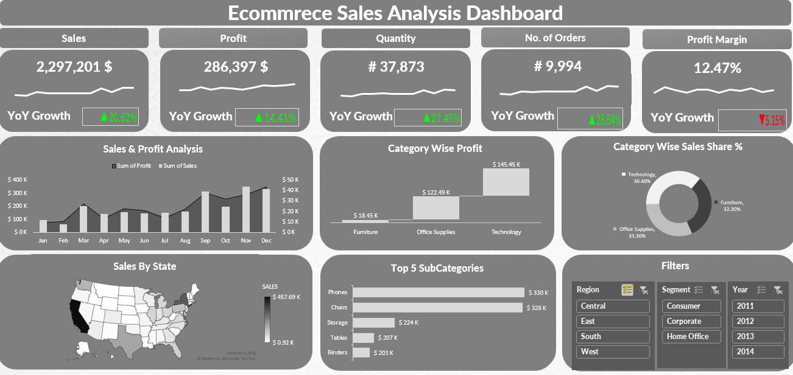

# Ecommerce Sales Analysis Dashboard

## Overview
The **Ecommerce Sales Analysis Dashboard** is a dynamic and interactive Excel-based tool designed to provide insights into key sales metrics for an eCommerce business. This dashboard visually represents sales, profit, quantity sold, orders, and category-wise performance across different dimensions such as time, geography, and product categories.

## Features
- **Key Metrics:**
  - Total Sales: $2,297,201
  - Total Profit: $286,397
  - Quantity Sold: 37,873 units
  - Number of Orders: 9,994
  - Profit Margin: 12.47%
  
- **Year-over-Year Growth:**
  - Sales: +20.62%
  - Profit: +14.41%
  - Quantity: +27.45%
  - Number of Orders: +28.64%
  - Profit Margin: -5.15%

- **Visualizations:**
  - Monthly Sales and Profit Trends
  - Sales and Profit by State
  - Category-wise Profit and Sales Share (%)
  - Top 5 Subcategories by Sales

- **Filters:**
  - Region (Central, East, South, West)
  - Segment (Consumer, Corporate, Home Office)
  - Year (2011–2014)

## Tools Used
- **Microsoft Excel**
  - Data Cleaning and Transformation
  - Pivot Tables and Pivot Charts
  - Slicers for interactive filtering

## Data Source
The dataset used for this dashboard contains eCommerce transaction records, including details about sales, profit, quantity, and orders across various categories, subcategories, regions, and time periods.

## Insights
- The highest profit is derived from the **Technology** category ($145.45K).
- The **Central** region has the highest sales performance.
- **Phones** and **Chairs** are the top-performing subcategories in terms of sales.
- Despite overall growth, the profit margin decreased slightly (-5.15%).

## How to Use
1. Download the Excel file [here](./Ecommerce Sales Analysis.xlsx).
2. Open the file in Microsoft Excel (compatible with versions supporting slicers and pivot tables).
3. Use the slicers on the dashboard to filter data by Region, Segment, or Year.
4. Analyze key metrics and visualizations to understand sales performance.

## Contact
If you have any questions or feedback about this project, feel free to reach out:
- **Name:** Bahaa Medhat Wanas
- **Email:** bahaawanas427@gmail.com
- **LinkedIn:** [Bahaa Wanas](https://www.linkedin.com/in/bahaa-wanas-9797b923a)
